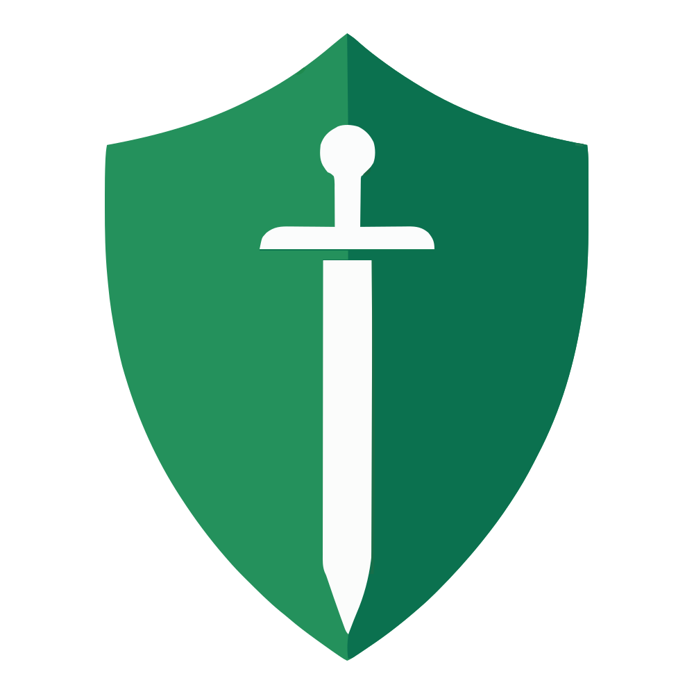

<div align="center">



# Sentinel

**Skill-based organizational risk analyzer**

*Who can your team afford to lose? Find out before it hurts.*


</div>

---

## Table of contents

- [The story](#the-story)
- [What it does](#what-it-does)
  - [Dashboard — the morning briefing](#dashboard--the-morning-briefing)
  - [Projects — health profiles, not just task lists](#projects--health-profiles-not-just-task-lists)
  - [People — more than an employee directory](#people--more-than-an-employee-directory)
  - [Planning & simulation — the centerpiece](#planning--simulation--the-centerpiece)
  - [Settings — the org, modeled properly](#settings--the-org-modeled-properly)
- [How it thinks](#how-it-thinks)
- [Getting started](#getting-started)
  - [Prerequisites](#prerequisites)
  - [Setup](#setup)
  - [Scripts](#scripts)
  - [Auth, in one paragraph](#auth-in-one-paragraph)
- [Architecture](#architecture)
  - [Code layout](#code-layout)
  - [House rules](#house-rules)
- [Scope & roadmap](#scope--roadmap)

## The story

Every team has one. The person who set up the deployment pipeline three years ago. The only one who *really* understands the billing module. The developer everyone Slacks when the legacy service starts acting up.

Nobody planned for it. Knowledge just... concentrates. It pools around whoever happened to be there when the system was built. And it stays invisible — right up until that person books three weeks off, changes teams, or hands in their notice. Then a "fully staffed" project suddenly can't ship, and everyone discovers the org chart and the *knowledge* chart were never the same picture.

The industry has a grim name for this: the **bus factor** — how many people need to get hit by a bus before a project stops. For an alarming number of projects, the answer is *one*.

Sentinel was built to make that risk visible **before** it becomes an incident. It treats skills like the critical infrastructure they are: it maps who knows what, measures how exposed each project is, and — this is the fun part — lets you **simulate absences** on the real planning to see exactly what would break, and when. Not a gut feeling. A number, a date, and a name.

Every screen in the app answers one question:

> **"What is the risk, and what should I do about it?"**

## What it does

### Dashboard — the morning briefing
One screen to start the day: team status of today (who's in, who's out), live knowledge coverage, projects currently in the danger zone, and a timeline of **upcoming risk events** — moments in the near future where planned absences will collide and leave a critical skill uncovered. You can also import planning data straight from here.

### Projects — health profiles, not just task lists
Each project gets a full risk checkup:

- **Coverage summary** — how well the project's required skills are actually covered by the assigned team.
- **Competency radar** — required level vs. available level, per skill, at a glance.
- **Knowledge matrix** — the grid of who-knows-what, which makes single points of failure embarrassingly obvious.
- **Fragility alerts** — skills held by exactly one person, low-redundancy areas, and the people whose absence would do the most damage.
- **Lifecycle management** — projects can be paused, resumed, completed, archived, and reopened, with stats following along.

### People — more than an employee directory
Every person has a profile with their skills and levels, a competency radar, current capacity, project assignments, and absence history. Sentinel also generates **recommendations**: where a knowledge transfer or a skill bump would reduce the most organizational risk for the least effort.

### Planning & simulation — the centerpiece
A Gantt-style monthly planning of the whole team, with real absences laid out. Switch to **simulation mode** and the planning becomes a sandbox:

1. Drop hypothetical absence blocks onto anyone's schedule — "what if Sarah takes the last two weeks of August?"
2. Watch coverage, capacity, and project health **recalculate against the real data**.
3. Inspect the impact: which projects degrade, which skills go dark, on which exact days.
4. Then decide — discard the scenario, or **apply it** to make it real.

Draft scenarios are stored locally and survive page reloads, so you can build a scenario, sleep on it, and decide tomorrow.

### Settings — the org, modeled properly
Working days, company holidays, calendar rules (with an impact preview before you save), departments, skills and skill categories. The risk engine is only as good as the calendar it reasons over, so the calendar is a first-class citizen.

## How it thinks

Sentinel's risk model rests on a few core concepts:

| Concept | Meaning |
|---|---|
| **Bus factor** | Minimum number of people whose loss critically impacts a project. Lower = scarier. |
| **Skill coverage** | `covered skills / required skills` — how much of what the project *needs* the team actually *has*, accounting for who is available. |
| **Fragility** | A numeric score capturing how dependent a project is on irreplaceable individuals. |
| **Severity** | The single badge-level risk language used everywhere in the UI: `ok` · `warning` · `critical`. Green means sleep well. Red means make a plan. |
| **Risk events** | Future dates where planned absences overlap in a way that drops coverage below safe levels — risk with a timestamp. |

The heavy computation lives in the Laravel backend; this frontend's job is to make the results **legible and actionable** — semantic colors, badges, radars, and matrices instead of raw numbers.

## Getting started

### Prerequisites

- **Node.js 20+** and npm
- The **Sentinel Laravel API** running locally (separate repository) — the frontend is a client, not an island

### Setup

```bash
# 1. Clone and enter
git clone <this-repo>
cd Sentinel-Frontend

# 2. Install dependencies
npm install

# 3. Point at your API (optional — defaults to http://localhost:8000)
echo "VITE_API_BASE_URL=http://localhost:8000" > .env.local

# 4. Run
npm run dev
```

Open the printed URL (Vite defaults to `http://localhost:5173`), log in with an account from the backend, and you land on the dashboard.

### Scripts

| Command | What it does |
|---|---|
| `npm run dev` | Dev server with hot reload |
| `npm run build` | Type-check (`tsc -b`) + production build |
| `npm run preview` | Serve the production build locally |
| `npm run lint` | ESLint over the whole project |

### Auth, in one paragraph

Token-based (Laravel Sanctum). On login the API returns a Bearer token, stored in `localStorage` and attached to every request by an Axios interceptor. Any `401` outside the login call clears the token and kicks you back to `/login`. Simple on purpose — this is a proof of concept, not a bank.

## Architecture

```
Frontend (React + ShadCN)  ←  you are here
        ↓ REST
Laravel API (risk engine, simulation engine)
        ↓
MySQL
```

The frontend is fully decoupled and stateless toward the API: TanStack Query owns the server cache, React state owns the UI.

### Code layout

```
src/
├── api/          # One React Query hook per endpoint, grouped by domain:
│                 # projects/, user/, planning/, absence/, skill/,
│                 # skillCategory/, department/, dashboard/, settings/
├── pages/        # One file per route: Dashboard, Projects, ProjectDetail,
│                 # Users, UserDetail, Planning, Profile, Settings, Login
├── components/
│   ├── ui/       # ShadCN base components (button, sheet, dialog, …)
│   ├── common/   # Reusable blocks: cards, inputs, tables, pagination, charts
│   ├── layout/   # Sidebar, topbar, root & protected route layouts
│   └── specified/# Feature components — split by model (project, user,
│                 # absence, skill, …) and by page (home, planning, settings, …)
├── lib/
│   ├── api/      # Axios client, token storage, error helpers,
│   │             # createMutationHook factory
│   └── theme/    # The tone system — every status/severity color in the app
├── types/        # Domain models + API request/response types, mirrored per domain
├── hooks/        # Generic hooks: pagination, sorting, debounce, tab params,
│                 # gantt gestures, localStorage state
└── context/      # AuthContext, PageContext
```

Roughly **400 TypeScript files, ~21k lines**. The structure is deliberately boring: if you know which domain you're touching, you know where the file is.

### House rules

Three conventions keep the codebase predictable (full details in `CLAUDE.md`):

1. **Display components never receive `isLoading`.** The caller renders `Component.Skeleton` while loading; the component itself only handles three states — value, empty (`—`), and error. No loading flags leaking down the tree.

   ```tsx
   {isLoading
     ? <MyDisplay.Skeleton icon={Mail} label="Email" />
     : <MyDisplay icon={Mail} label="Email" value={user?.email} />}
   ```

2. **Mutation hooks return named actions, never raw `useMutation` results.**

   ```ts
   const { updateOrganizationSettings, isLoading } = useUpdateOrganizationSettings();
   await updateOrganizationSettings(form);
   ```

   Toasts and cache invalidation live inside the hook; call sites stay clean and never touch React Query internals.

3. **All status colors come from `src/lib/theme/`.** Severity is one three-level concept (`ok | warning | critical`) shared by the entire UI. No component invents a local color scale, no dynamic Tailwind class strings. Green, yellow, red mean the same thing on every screen.

## Scope & roadmap

Sentinel is a **proof of concept**, deliberately scoped: simple token auth, no real-time collaboration, no enterprise checkbox bingo. The energy goes into getting the risk model and the UI right.

The architecture leaves the door open for what's next: role-based access control, historical risk tracking, AI-based recommendations, HR-tool integrations, and automated skill inference.

---

<div align="center">

*Sentinel is not just a dashboard — it's a decision-support tool.*

</div>
